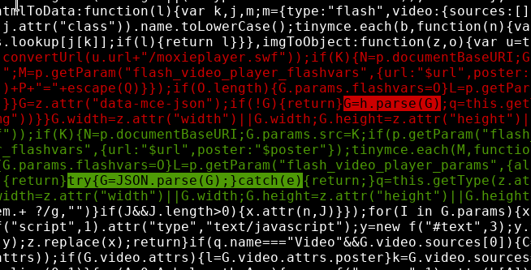

# IntegerNet TinyMCE Fix Embeds

[![Software License][ico-license]](LICENSE.md)

Magento 1 Bugfix for WYSIWYG editor

## Description

Make iframe + video tags work again in tinyMCE

This module fixes a Magento *bug introduced in Magento 1.9.4.3* where a try/catch block had been added to `editor_plugin.js` and `editor_plugin_src.js`. Wrong variable naming in the minified file version leads to *iframes and video tags being rejected by tinyMCE*.

- `js/integernet/adminhtml/wysiwyg/tiny_mce/setup.js` is an almost exact copy of `mage/adminhtml/wysiwyg/tiny_mce/setup.js` but removes the media plugin in favour of the new mediaIntegerNet plugin.
- `mediaIntegerNet` is an almost plain copy of the original media plugin as shipped in Magento 1.9.4.4 but with the variable name fixed in the minified `editor_plugin.js`

The source of the bug is this diff in `js/tiny_mce/plugins/media/editor_plugin.js` (apparently the minified file has been edited manually):



If you want to patch the file directly instead of installing this module, replace `JSON` with `h` in that file. Do not use the fixed file in this repository alone, because it also contains the changed plugin name and won't work in the original plugin.

## Requirements

- Magento CE 1.9.4.3+
- Magento EE 1.14.4.3+

## Installation Instructions

### Via Composer:

```
composer config repositories.tinymce git https://github.com/integer-net/tinymce-fix-embeds
composer require integer-net/tinymce-fix-embeds
```

### Manually

Copy the `app` and `js` directories into your Magento document root.

## Credits

- [Lisa Buchholz](https://github.com/lbuchholz)


## License

The MIT License (MIT). Please see [License File](LICENSE.txt) for more information.

[ico-license]: https://img.shields.io/badge/license-MIT-brightgreen.svg?style=flat-square

